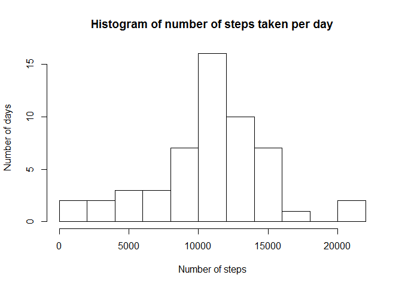
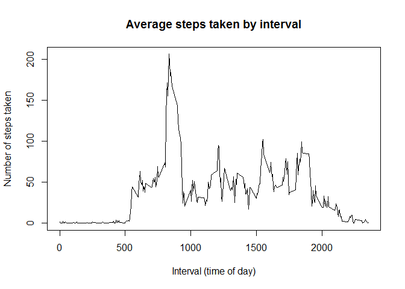
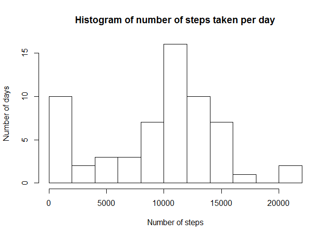
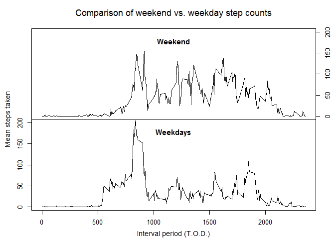

# Reproducible Research: Peer Assessment 1


## Loading and preprocessing the data
### 1. Code for reading in the dataset and/or processing the data

First, ensure that dependencies are available:

```r
require(dplyr)
```

```
## Loading required package: dplyr
```

```
## 
## Attaching package: 'dplyr'
```

```
## The following objects are masked from 'package:stats':
## 
##     filter, lag
```

```
## The following objects are masked from 'package:base':
## 
##     intersect, setdiff, setequal, union
```

Then I load the activity data into memory from the source, and read it into _data_.  The data used were downloaded on the 8th July 2016 and is also stored in this repository (as _activity.csv_, in case the source data file hosted by Coursera changes or is moved).


```r
temp <- tempfile()
download.file("https://d396qusza40orc.cloudfront.net/repdata%2Fdata%2Factivity.zip", temp, mode = "wb")
data <- unzip(temp, "activity.csv")
data <- read.csv(data)
unlink(temp)
```

### 1.1. Data processing
Because the date variable in the source file is interpreted as a factor variable, we will need to convert it to an acceptable date format for further analysis.


```r
data[,2] <- as.Date(data[,2], format = "%Y-%m-%d")
```

## What is mean total number of steps taken per day?
### 2. Histogram of the total number of steps taken each day

First, I generate a histogram to illustrate the distribution of steps taken per day, based on the aggregated sum of the steps taken.

```r
steps <- aggregate(data$steps, list(data$date), FUN = "sum")
hist(steps[ ,2], breaks = 10, main = "Histogram of number of steps taken per day", xlab = "Number of steps", ylab = "Number of days")
```

<!-- -->

### 3. Mean and median number of steps taken each day

Looking more closely at the numbers, I observe that the mean number of steps taken per day is 10,766.19, and the median is 10,765 steps.  These measures are are returned using the below code:

```r
mean(steps[ ,2], na.rm = TRUE)
```

```
## [1] 10766.19
```

```r
median(steps[ ,2], na.rm = TRUE)
```

```
## [1] 10765
```

## What is the average daily activity pattern?
### 4. Time series plot of the average number of steps taken

On average, the following time series plot shows that the majority of the subject's steps are taken in the second quintile of the day.  One could hypothesise that s/he is in the habit of taking a morning run or perhaps walks to work.  The following code is used to first calculate the mean number of steps taken for each time period interval, and then plotting the same.


```r
interval.steps <- aggregate(data$steps, list(data$interval), FUN = "mean", na.rm = TRUE)
plot(interval.steps[,1], interval.steps[,2], type = "l", main = "Average steps taken by interval", xlab = "Interval (time of day)", ylab = "Number of steps taken")
```

<!-- -->

### 5. The 5-minute interval that, on average, contains the maximum number of steps

The interval with the most number of steps, on average (viz. 206.1698 steps), is interval no. 835.  We arrive at this conclusion using the below code which retrieves the value in the first column of _interval.steps_ for the corresponding maximum number in the column storing the mean values.  This also corresponds well with the time plot, above.

```r
interval.steps[interval.steps[,2] == max(interval.steps[,2]), 1]
```

```
## [1] 835
```


## Imputing missing values
### 6. Code to describe and show a strategy for imputing missing data

2,304 observations of step counts are missing in the data, as is highlighted by counting the number of NAs:

```r
sum(is.na(data$steps))
```

```
## [1] 2304
```

To arrive at a more accurate result, the missing values will be imputed by means of calculating the median number of steps per interval, and then replacing the NAs with the corresponding median step value for each such interval.

First, I calculate the median steps for each interval, and store these in _interval.steps.median_

```r
interval.steps.median <- aggregate(data$steps, list(data$interval), FUN = "median", na.rm = TRUE)
colnames(interval.steps.median) <- c("interval", "median.steps")
```

Secondly, using dplyr, the interval.steps.median are merged into a copy of the original 'data' data frame, called 'data.imputed'.

```r
data.imputed <- data
data.imputed <- dplyr::full_join(data.imputed, interval.steps.median, by = "interval")
```

Thirdly, I replace NAs in _data.imputed\$steps_ with values in _data.imputed\$median.steps_

```r
data.imputed$steps[is.na(data.imputed$steps)] <- data.imputed$median.steps[is.na(data.imputed$steps)]
```

Finally, I remove the interim _data.imputed\$median.steps_ variable as it is now no longer needed.

```r
data.imputed <- data.imputed[,1:ncol(data.imputed) - 1]
```

### 7. Histogram of the total number of steps taken each day after missing values are imputed

To illustrate the impact of imputing the missing values, I re-calculate the histogram, mean, and median from earlier.  These calculations are done using the same process, whereby the aggregated sum is calculated and stored in a variable called _steps_ which is subsequently used to generate the outputs.

The aggregation and histogram:

```r
steps <- aggregate(data.imputed$steps, list(data.imputed$date), FUN = "sum")
hist(steps[ ,2], breaks = 10, main = "Histogram of number of steps taken per day", xlab = "Number of steps", ylab = "Number of days")
```

<!-- -->

The mean:

```r
mean(steps[ ,2], na.rm = TRUE)
```

```
## [1] 9503.869
```

The median:

```r
median(steps[ ,2], na.rm = TRUE)
```

```
## [1] 10395
```

From this we can conclude that by imputing missing values, the total number of available values are increased, and that those values are over-all lower than average.  The mean number of steps per day is now about 9,504 as opposed to the earlier 10,766.  The median, too, is lower, but less dramatically impacted than the mean: we are now observing 10,395 instead of the previous 10,765.  The histogram clearly illustrates that the number of 0-step intervals has increased, consequently causing the decrease in the average.

## Are there differences in activity patterns between weekdays and weekends?
### 8. Panel plot comparing the average number of steps taken per 5-minute interval across weekdays and weekends

To observe differences between weekdays and weekends, I first add a column to the second data frame _data.imputed_ storing the day of the week the dates in the date column correspond to:

```r
data.imputed <- cbind(data.imputed, day.of.week = weekdays(data.imputed$date))
```

To categorise the days of the week into a factor variable storing either "Weekday" or "Weekend", the following code, which first sets _day.of.week_ to a character class to enable easy comparison, then replaces the relevant weekdays with the desired categories, and finally turns the variable back into factor class again, is run:


```r
data.imputed$day.of.week <- as.character(data.imputed$day.of.week)
data.imputed$day.of.week[data.imputed$day.of.week == "Sunday" | data.imputed$day.of.week == "Saturday"] <- "Weekend"
data.imputed$day.of.week[data.imputed$day.of.week != "Weekend"] <- "Weekday"
data.imputed$day.of.week <- as.factor(data.imputed$day.of.week)
```

Next, two data frames are created, each storing the mean number of steps taken for each interval, one for weekdays and one for weekends.


```r
steps.weekend <- aggregate(data.imputed$steps[data.imputed$day.of.week == "Weekend"], list(data.imputed$interval[data.imputed$day.of.week == "Weekend"]), FUN = "mean")
steps.weekday <- aggregate(data.imputed$steps[data.imputed$day.of.week == "Weekday"], list(data.imputed$interval[data.imputed$day.of.week == "Weekday"]), FUN = "mean")
```

These data frames are then used to create two time series plots that allow us to compare weekday activity with weekend activity.  The plots are generated in base graphics.

```r
par(mfrow = c(2, 1),  oma = c(0, 1, 0, 0), mar = c(4, 4, 2, 2), cex = 0.8)
par(mai = c(0, 0.5, 0.6, 0.4))
plot(steps.weekend[ ,1], steps.weekend[ ,2], ylim = c(0, 200), type = "l", axes = FALSE, frame.plot = TRUE,
     xlab = "", ylab = "")
title("Weekend", line = -2)
Axis(side = 4, labels = TRUE)
mtext("Comparison of weekend vs. weekday step counts", side = 3, line = 1.5, cex = 1.1)
mtext("Mean steps taken", side = 2, line = -.5, cex = .9, outer = TRUE)

par(mai = c(0.6, 0.5, 0, 0.4))
plot(steps.weekday[ ,1], steps.weekday[ ,2], ylim = c(0, 200), type = "l", xlab = "", ylab = "")
title("Weekdays", line = -2)
mtext("Interval period (T.O.D.)", side = 1, line =2.5, cex = .9)
```

<!-- -->

Some differences can be seen in the weekend vs. weekday split for our subject, who appears more sedentary during the week, and more active during the weekend.

### 9. All of the R code needed to reproduce the results (numbers, plots, etc.) in the report
All code used is included in this document.
